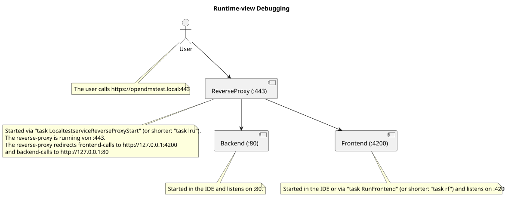
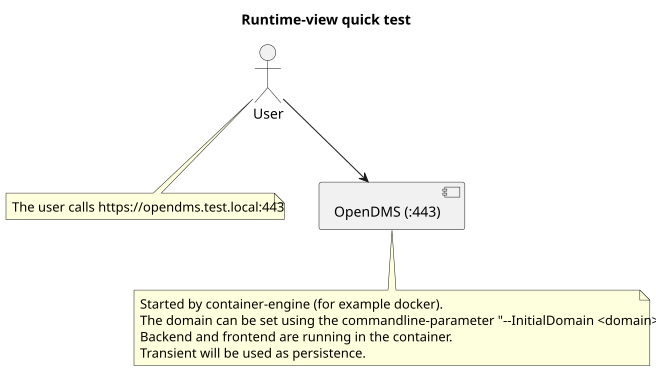
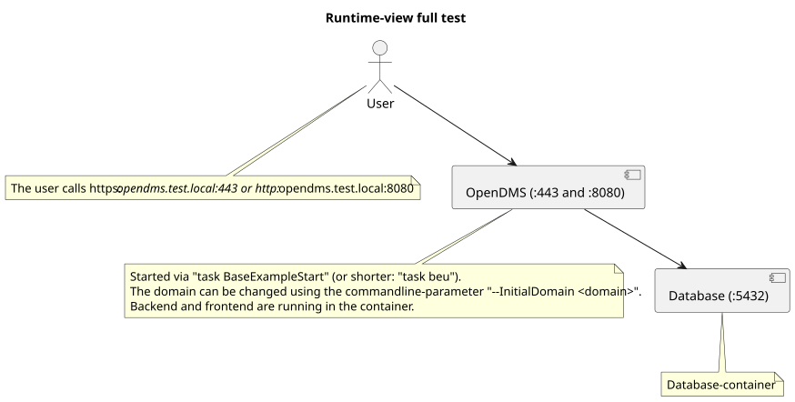
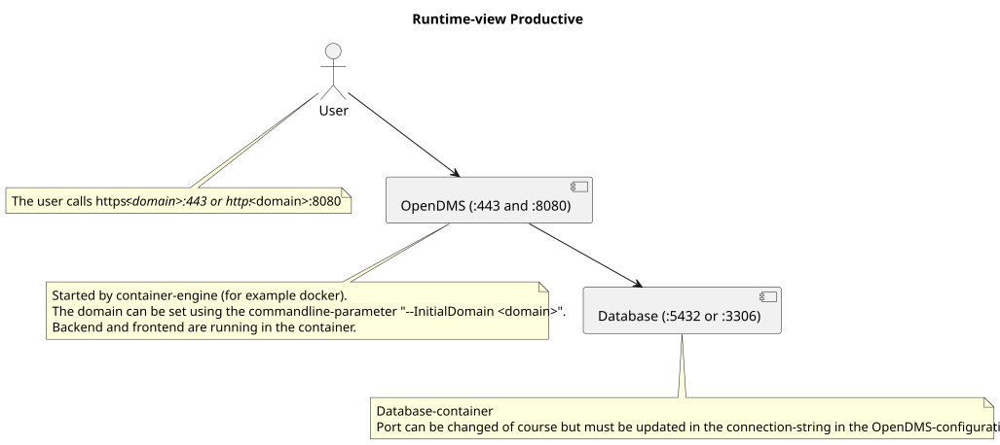

# 6. Runtime View

### Networking

#### Debugging

When developing/debugging the following components are used usually:

#### Testing

##### Quick test

For a quick test with a transient persistent `task BaseQuickStart` (or shorter: `task bqs`) is the correct command.
(Do `Ctrl+c` to abort the test.)
This starts OpenDMS locally in a container with a transient persistence:

##### Full test

For testing the entire app including a database-connection `task BaseExampleStart` (or shorter: `task beu`) is the correct command.
This starts OpenDMS locally in a container with a PostgreSQL-persistence:

#### Productive

The productive runtime-view is very similar to the "Full test":

## Timezones

When running in containers then there is no system-timezone available anymore.
Until now there is no feature to pass a timezone into the container.
So in the container the log-timestamps are always in GMT+00:00 (UTC).
